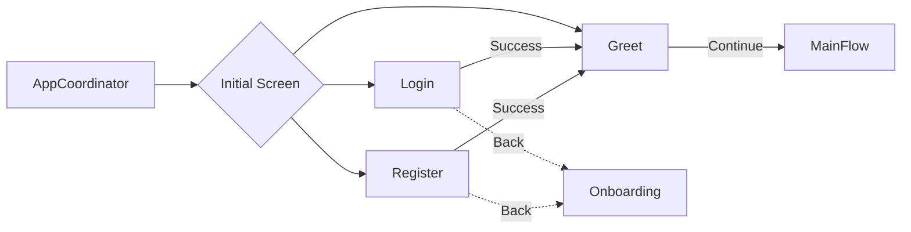

# Authentication Module

> Handles user login, registration, and welcome flows.

## Dependencies

| Package | Purpose |
|---------|---------|
| SignQuestUI | Shared UI components (text fields, buttons) |
| SignQuestInterfaces | `AppCoordinatorProtocol`, `NavigationCoordinatorProtocol` |
| SignQuestCore | `UserDefaultsManager` |
| SignQuestModels | `SQUser` model |
| FirebaseAuth | Authentication API |

---

## Directory Structure

```
Sources/Authentication/
├── Data/                         # (unused)
├── Service/
│   ├── Coordinator/              # Navigation coordinator
│   └── Network/                  # Firebase Auth calls
└── UI/
    ├── View/
    │   ├── Coordinator/          # CoordinatorView wrapper
    │   ├── Greet/                # Welcome back screen
    │   ├── Login/                # Login form
    │   └── Register/             # Multi-step registration
    │       └── Page/             # Individual registration pages
    └── ViewModel/
        ├── Greet/
        ├── Login/
        └── Register/
```

---

## Navigation Flow



### Screen Types

```swift
public enum SQAuthenticationScreenType {
    case login      // Email/password login
    case register   // Multi-step registration
    case greet      // Welcome screen after auth
}
```

---

## Key Files

| File | Purpose |
|------|---------|
| [SQAuthenticationCoordinator.swift](file://Sources/Authentication/Service/Coordinator/SQAuthenticationCoordinator.swift) | Navigation state, screen building |
| [SQAuthenticationNetworkService.swift](file://Sources/Authentication/Service/Network/SQAuthenticationNetworkService.swift) | Firebase Auth login/register |
| [SQLoginViewModel.swift](file://Sources/Authentication/UI/ViewModel/Login/SQLoginViewModel.swift) | Login validation and API call |
| [SQRegisterViewModel.swift](file://Sources/Authentication/UI/ViewModel/Register/SQRegisterViewModel.swift) | Multi-step form state management |
| [SQGreetViewModel.swift](file://Sources/Authentication/UI/ViewModel/Greet/SQGreetViewModel.swift) | Transition to main flow |

---

## Registration Flow

The registration is a **4-step wizard**:

| Step | Page | Fields | Validation |
|------|------|--------|------------|
| 1 | `SQRegistrationAgePage` | Age | Required, numeric |
| 2 | `SQRegistrationNamePage` | First Name, Last Name | Required |
| 3 | `SQRegistrationEmailPage` | Email | Valid email format |
| 4 | `SQRegistrationPasswordPage` | Password, Confirm | Match + strength |

### State Management

```swift
class SQRegisterViewModel: ObservableObject {
    @Published var currentTab = 0           // Current step (0-3)
    @Published var progressAmount = 25.0    // Progress bar (25-100)
    
    // Form fields
    @Published var age = ""
    @Published var firstName = ""
    @Published var lastName = ""
    @Published var email = ""
    @Published var password = ""
    @Published var confirmPassword = ""
    
    // Page validation flags
    @Published var agePageValid = false
    @Published var namePageValid = false
    @Published var emailPageValid = false
    @Published var passwordPageValid = false
}
```

### Navigation Methods

```swift
func incrementTabProgress()  // Move to next page
func decrementTabProgress()  // Move to previous page
func createAccount()         // Final submit
```

---

## Firebase Integration

### Network Service Protocol

```swift
protocol SQAuthenticationNetworkServiceProtocol {
    func login(email: String, password: String) async throws
    func register(user: SQUser, password: String) async throws
}
```

### Login Flow

```swift
func login(email: String, password: String) async throws {
    try await Auth.auth().signIn(withEmail: email, password: password)
}
```

### Registration Flow

```swift
func register(user: SQUser, password: String) async throws {
    // 1. Create Firebase Auth user
    let authResult = try await Auth.auth().createUser(withEmail: user.email, password: password)
    let uid = authResult.user.uid
    
    // 2. Save user profile to Firestore
    try db.collection("users").document(uid).setData(from: user)
}
```

---

## Coordinator Pattern

### Entry Point

```swift
public struct SQAuthenticationCoordinatorView: View {
    let appCoordinator: any AppCoordinatorProtocol
    @StateObject var coordinator: SQAuthenticationCoordinator
    var initialScreen: SQAuthenticationScreenType = .login
    
    public var body: some View {
        NavigationStack(path: $coordinator.path) {
            coordinator.build(initialScreen)
                .navigationDestination(for: SQAuthenticationScreenType.self) { screen in
                    coordinator.build(screen)
                }
        }
        .environmentObject(coordinator)
    }
}
```

### ViewModel Linking

ViewModels receive coordinator via `setCoordinator(_:)`:

```swift
// In View
.onAppear {
    viewModel.setCoordinator(coordinator)
}
```

---

## Common Tasks

### Adding a New Screen

1. Add case to `SQAuthenticationScreenType`
2. Create View in `UI/View/NewScreen/`
3. Create ViewModel in `UI/ViewModel/NewScreen/`
4. Add case to `build(_:)` in `SQAuthenticationCoordinator`

### Adding Email Validation

Validation lives in ViewModel:

```swift
func validateEmail() -> Bool {
    let emailRegex = #"^[A-Z0-9a-z]..."#
    let emailPredicate = NSPredicate(format: "SELF MATCHES %@", emailRegex)
    return emailPredicate.evaluate(with: email)
}
```

### Adding Social Login (Future)

1. Add Firebase SDK for provider (Google, Apple)
2. Add new method to `SQAuthenticationNetworkServiceProtocol`
3. Add UI button to `SQLoginView`
4. Handle OAuth flow in ViewModel

---

## Known Issues

- Login error handling is minimal (errors not displayed to user)
- No "Forgot Password" flow implemented
- Tests are empty stubs
