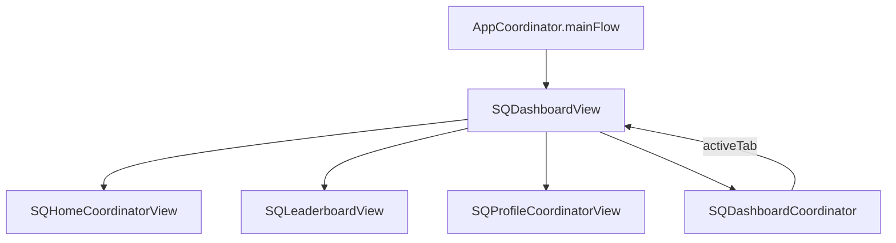

# Dashboard Module

> Tab-based container hosting Home, Leaderboard, and Profile.

## Dependencies

| Package | Purpose |
|---------|---------|
| SignQuestUI | Shared colors, components |
| SignQuestInterfaces | `TabBarCoordinatorProtocol` |

---

## Directory Structure

```
Sources/Dashboard/
├── SQDashboardCoordinator.swift  # Tab state management
└── SQDashboardView.swift         # TabView container
```

> [!NOTE]
> This is the simplest feature module — just 2 source files.

---

## Tab Structure

```swift
public enum SQTabType: String, CaseIterable {
    case home        // house icon
    case leaderboard // trophy icon
    case profile     // person icon
}
```

---

## Architecture



### View Composition

Dashboard receives child views as `AnyView` parameters:

```swift
public init(
    homeCoordinatorView: some View,
    leaderboardCoordinatorView: some View,
    profileCoordinatorView: some View
)
```

This allows `AppCoordinator` to inject feature views without Dashboard depending on those modules.

---

## Coordinator

```swift
@MainActor
public class SQDashboardCoordinator: TabBarCoordinatorProtocol {
    public var activeTab: SQTabType = .home
    
    public func switchTab(to tab: SQTabType) {
        activeTab = tab
    }
}
```

The coordinator is injected as `@EnvironmentObject` for child views to programmatically switch tabs.

---

## TabBar Styling

Custom `UITabBarAppearance` configuration:

```swift
let appearance = UITabBarAppearance()
appearance.backgroundColor = UIColor(SQColor.background.color)
appearance.stackedLayoutAppearance.normal.iconColor = UIColor(SQColor.muted.color)
appearance.shadowColor = UIColor(SQColor.line.color)
```

---

## Common Tasks

### Adding a New Tab

1. Add case to `SQTabType` enum
2. Add icon name in `iconName` computed property
3. Add view parameter to `SQDashboardView.init()`
4. Add tab item in `body`

### Programmatic Tab Switching

From any child view:

```swift
@EnvironmentObject var dashboardCoordinator: SQDashboardCoordinator

func goToProfile() {
    dashboardCoordinator.switchTab(to: .profile)
}
```

---

## Known Issues

- Tests are empty stubs
