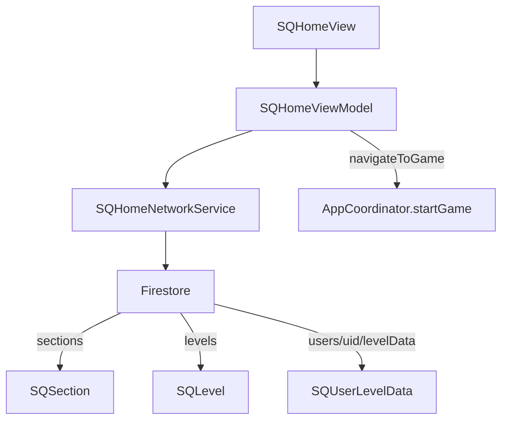

# Home Module

> Level selection and user progress tracking.

## Dependencies

| Package | Purpose |
|---------|---------|
| SignQuestUI | Shared components (level buttons, progress) |
| SignQuestInterfaces | Coordinator protocols |
| SignQuestModels | `SQSection`, `SQLevel`, `SQUserLevelData` |
| SignQuestCore | `UserManager` |
| FirebaseAuth | User authentication |

---

## Directory Structure

```
Sources/Home/
├── Service/
│   ├── Coordinator/              # Navigation to game
│   └── Network/                  # Sections, levels, progress fetching
└── UI/
    ├── View/
    │   ├── Coordinator/          # CoordinatorView wrapper
    │   ├── Home/                 # Main level grid
    │   └── Section/              # Section header + levels
    └── ViewModel/
        └── Home/                 # Content loading and state
```

---

## Data Flow



---

## Level Status System

Levels have three states:

| Status | Display | Navigation |
|--------|---------|------------|
| `locked` | Grayed out | Blocked |
| `available` | Default | Allowed |
| `completed` | Checkmark | Allowed |

### Status Logic

```swift
func status(for level: SQLevel) -> SQUserLevelDataStatus {
    // First level of first section is always available
    if userProgress.isEmpty && level.number == 1 && sections.first?.id == level.sectionId {
        return .available
    }
    return userProgress[levelId]?.status ?? .locked
}
```

---

## Key Files

| File | Purpose |
|------|---------|
| [SQHomeViewModel.swift](file://Sources/Home/UI/ViewModel/Home/SQHomeViewModel.swift) | Content loading, progress tracking |
| [SQHomeNetworkService.swift](file://Sources/Home/Service/Network/SQHomeNetworkService.swift) | Firestore queries |
| [SQHomeCoordinator.swift](file://Sources/Home/Service/Coordinator/SQHomeCoordinator.swift) | Navigation to Play module |
| [SQSectionView.swift](file://Sources/Home/UI/View/Section/SQSectionView.swift) | Section header + level grid |

---

## Network Service

```swift
protocol SQHomeNetworkServiceProtocol: Sendable {
    func fetchSections() async throws -> [SQSection]
    func fetchLevels() async throws -> [SQLevel]
    func fetchUserLevelData(for userID: String) async throws -> [SQUserLevelData]
    func createUserLevelDataBatch(for userId: String, levelDataItems: [(levelId: String, levelData: SQUserLevelData)]) async throws
}
```

### Firestore Collections

| Collection | Use |
|------------|-----|
| `sections` | All sections |
| `levels` | All levels |
| `users/{uid}/levelData` | User's progress per level |

---

## Initialization Flow

On first load, if user has no progress data:

1. Fetch all levels and sections
2. Find missing levels (no progress record)
3. Initialize `SQUserLevelData` for each level
   - First level of first section → `available`
   - All others → `locked`
4. Batch save to Firestore

---

## Common Tasks

### Adding a New Section

1. Add document to `sections` collection in Firestore
2. Set `number` field for ordering
3. Levels reference section via `sectionId`

### Adding a New Level

1. Add document to `levels` collection
2. Include `sectionId`, `number`, `name`, `minScore`
3. App will auto-initialize `levelData` for new users

### Modifying Level Unlock Logic

Edit `SQHomeViewModel.status(for:)` to change how levels become available.

---

## Known Issues

- Tests are empty stubs
- No pull-to-refresh implementation
- Error states not displayed to user
