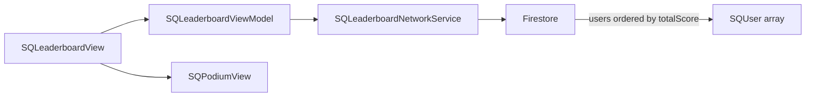

# Leaderboard Module

> Rankings displaying top users by score.

## Dependencies

| Package | Purpose |
|---------|---------|
| SignQuestUI | Shared components |
| SignQuestInterfaces | Coordinator protocols |
| SignQuestModels | `SQUser` |
| FirebaseFirestore | User rankings |

---

## Directory Structure

```
Sources/Leaderboard/
├── Service/
│   ├── Coordinator/              # (minimal - no sub-navigation)
│   └── Network/                  # Firestore leaderboard query
└── UI/
    ├── View/
    │   ├── Coordinator/          # CoordinatorView wrapper
    │   ├── Leaderboard/          # Main rankings list
    │   └── Podium/               # Top 3 display
    └── ViewModel/
        └── SQLeaderboardViewModel.swift
```

---

## Data Flow



---

## Query

Fetches top 10 users by score:

```swift
func fetchLeaderboardData() async throws -> [SQUser] {
    let db = Firestore.firestore()
    let snapshot = try await db.collection("users")
        .order(by: "totalScore", descending: true)
        .limit(to: 10)
        .getDocuments()
    
    return snapshot.documents.compactMap { document in
        try? document.data(as: SQUser.self)
    }
}
```

---

## Key Files

| File | Purpose |
|------|---------|
| [SQLeaderboardViewModel.swift](file://Sources/Leaderboard/UI/ViewModel/SQLeaderboardViewModel.swift) | Fetch and store leaderboard data |
| [SQLeaderboardNetworkService.swift](file://Sources/Leaderboard/Service/Network/SQLeaderboardNetworkService.swift) | Firestore query |
| [SQLeaderboardView.swift](file://Sources/Leaderboard/UI/View/Leaderboard/SQLeaderboardView.swift) | Rankings list UI |
| [SQPodiumView.swift](file://Sources/Leaderboard/UI/View/Podium/SQPodiumView.swift) | Top 3 podium display |

---

## ViewModel

Simple state machine:

```swift
@MainActor
class SQLeaderboardViewModel: ObservableObject {
    @Published var leaderboardData: [SQUser] = []
    @Published var isLoading: Bool = true
    
    func fetchLeaderboardData() async {
        isLoading = true
        // ... fetch from network
        isLoading = false
    }
}
```

---

## Common Tasks

### Changing Ranking Criteria

Edit the Firestore query in `SQLeaderboardNetworkService`:

```swift
// Example: Sort by levels completed
.order(by: "currentLevel", descending: true)
```

### Increasing User Limit

Change `.limit(to: 10)` to desired number.

### Adding Weekly/Monthly Filters

1. Add filter state to ViewModel
2. Create query variants in NetworkService
3. Add UI picker in LeaderboardView

---

## Known Issues

- No pull-to-refresh
- No current user highlight
- No pagination for large user bases
- Tests are empty stubs
