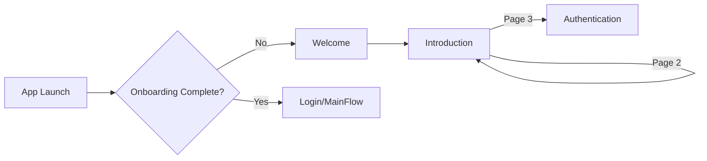

# Onboarding Module

> First-time user experience with welcome and introduction screens.

## Dependencies

| Package | Purpose |
|---------|---------|
| SignQuestUI | Shared components |
| SignQuestInterfaces | Coordinator protocols |
| SignQuestCore | `UserDefaultsManager` |

---

## Directory Structure

```
Sources/Onboarding/
├── Service/
│   └── Coordinator/              # Navigation to Authentication
└── UI/
    ├── View/
    │   ├── Coordinator/          # CoordinatorView wrapper
    │   ├── Introduction/         # Multi-page intro carousel
    │   └── Welcome/              # Initial welcome screen
    └── ViewModel/
        ├── Introduction/         # Page state, navigation
        └── Welcome/              # Start action
```

---

## Navigation Flow



### Screen Types

```swift
public enum SQOnboardingScreenType {
    case welcome        // Initial screen
    case introduction   // Multi-page carousel
}
```

---

## Introduction Pages

3 pre-defined pages:

| Page | Title | Bold Title | Subtitle |
|------|-------|------------|----------|
| 1 | "Welcome to" | "Sign Quest" | "Your journey into sign language starts here." |
| 2 | "A Place to Learn" | "SIBI" | "Practice signs, complete challenges, and track your progress." |
| 3 | "Ready to" | "Start?" | "Create your account and begin your quest today." |

```swift
struct IntroductionPage {
    let title: String
    let boldTitle: String
    let subtitle: String
}
```

---

## Key Files

| File | Purpose |
|------|---------|
| [SQOnboardingCoordinator.swift](file://Sources/Onboarding/Service/Coordinator/SQOnboardingCoordinator.swift) | Navigation to auth |
| [SQIntroductionViewModel.swift](file://Sources/Onboarding/UI/ViewModel/Introduction/SQIntroductionViewModel.swift) | Page state, content |
| [SQIntroductionView.swift](file://Sources/Onboarding/UI/View/Introduction/SQIntroductionView.swift) | Carousel UI |
| [SQWelcomeViewModel.swift](file://Sources/Onboarding/UI/ViewModel/Welcome/SQWelcomeViewModel.swift) | Start navigation |

---

## Completion Flag

Uses `UserDefaultsManager` to track completion:

```swift
// Mark as complete
UserDefaultsManager.shared.isOnboardingCompleted = true

// Check on app launch (in AppCoordinator)
if !UserDefaultsManager.shared.isOnboardingCompleted {
    appState = .onboarding
}
```

---

## ViewModel

```swift
class SQIntroductionViewModel: ObservableObject {
    @Published var pages: [IntroductionPage] = [...]
    @Published var currentTab = 0
    
    func incrementCurrentTab() {
        currentTab += 1
    }
    
    func navigateToRegistration() {
        UserDefaultsManager.shared.isOnboardingCompleted = true
        coordinator?.showAuthentication(isLogin: false)
    }
}
```

---

## Common Tasks

### Adding a New Intro Page

Add to `pages` array in `SQIntroductionViewModel`:

```swift
IntroductionPage(
    title: "New Title",
    boldTitle: "Bold Part",
    subtitle: "Description text."
)
```

### Adding Images to Intro Pages

1. Extend `IntroductionPage` struct with `imageName` property
2. Add images to asset catalog
3. Update `SQIntroductionPageView` to display image

### Skipping Onboarding

Set flag directly:

```swift
UserDefaultsManager.shared.isOnboardingCompleted = true
```

---

## Known Issues

- No animations between pages
- No skip button
- Page images not implemented
- Tests are empty stubs
