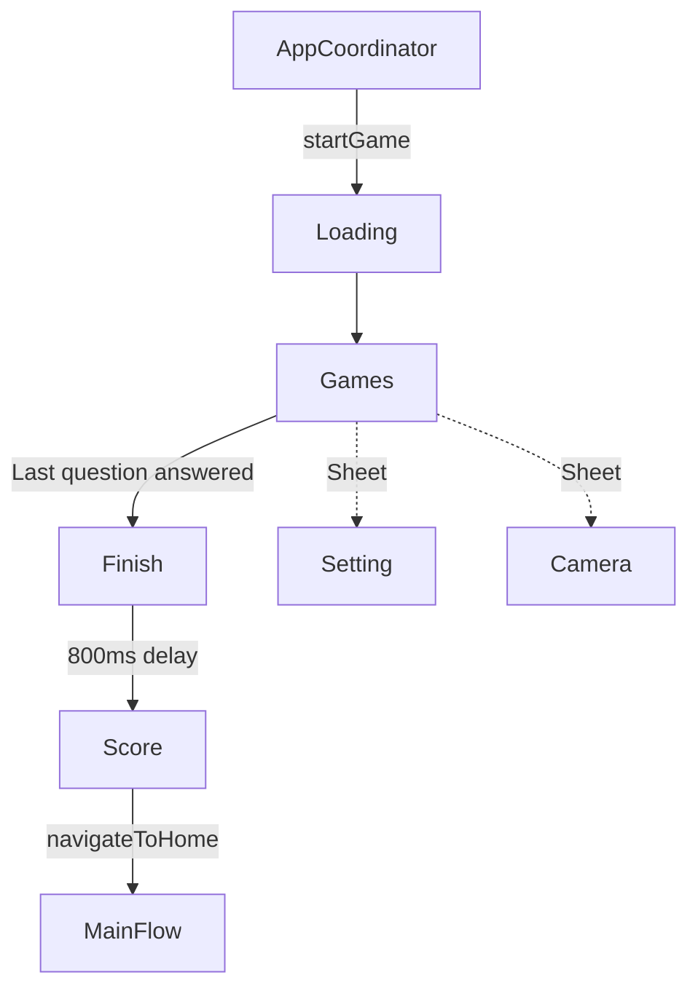

# Play Module

> Core gameplay with AI-powered gesture recognition using YOLO.

## Dependencies

| Package | Purpose |
|---------|---------|
| SignQuestUI | Shared components (buttons, progress bar) |
| SignQuestInterfaces | Coordinator protocols |
| SignQuestModels | `SQLevel`, `SQQuestion`, `SQGameSession` |
| SignQuestCore | `UserManager` |
| **YOLO** | ultralytics/yolo-ios-app for gesture detection |
| FirebaseAuth | User authentication |

> [!NOTE]
> This module requires **iOS 17+** due to YOLO SDK requirements.

---

## Directory Structure

```
Sources/Play/
├── Model/
│   └── yolo.mlmodel              # Gesture detection model
├── Service/
│   ├── Coordinator/              # Navigation + sheet coordination
│   └── Network/                  # Firestore level/question fetching
└── UI/
    ├── View/
    │   ├── Coordinator/          # CoordinatorView wrapper
    │   ├── Finish/               # Level complete screen
    │   ├── Games/
    │   │   ├── Camera/           # Camera sheet for gesture capture
    │   │   ├── Pages/            # 3 question type pages
    │   │   └── SQGamesView.swift # Main game container
    │   ├── Loading/              # Initial loading screen
    │   ├── Score/                # Results screen
    │   └── Setting/              # Pause/settings sheet
    └── ViewModel/
        └── Games/
            ├── SQGamesViewModel.swift
            └── Pages/SQGamesTypeThreePageViewModel.swift
```

---

## Navigation Flow



### Screen Types

```swift
public enum SQPlayScreenType {
    case loading    // Initial load
    case games      // Question display
    case finish     // "Level Complete!" transition
    case score      // Final results
}

public enum SQPlaySheetType {
    case setting                    // Pause menu
    case camera(Binding<UIImage?>)  // Camera for gesture capture
}
```

---

## Question Types

| Type | View | Input | Verification |
|------|------|-------|--------------|
| `selectAlphabet` | `SQGamesTypeOnePage` | Tap option | Index match |
| `selectGesture` | `SQGamesTypeTwoPage` | Tap option | Index match |
| `performGesture` | `SQGamesTypeThreePage` | Camera + ML | Label match |

### Question Routing in SQGamesView

```swift
switch question.type {
case .selectAlphabet:
    SQGamesTypeOnePage(...)
case .selectGesture:
    SQGamesTypeTwoPage(...)
case .performGesture:
    SQGamesTypeThreePage(...)
}
```

---

## ML Gesture Detection

### YOLO Integration

The module uses **Ultralytics YOLO** for real-time sign language detection.

| File | Purpose |
|------|---------|
| `Model/yolo.mlmodel` | Trained gesture detection model |
| `SQGamesTypeThreePageViewModel` | ML processing logic |
| `SQCameraView` | Camera capture UI |

### Detection Flow

```
User takes photo → UIImage → YOLO model → YOLOResult → Extract top detection → Compare with expected
```

### Key Code

```swift
class SQGamesTypeThreeViewModel: ObservableObject {
    private let yolo = YOLO("yolo", task: .detect)
    @Published var yoloResult: YOLOResult?
    
    func processImageWithYolo(_ image: UIImage) {
        yoloResult = yolo(image)
    }
    
    func getTopDetection() -> (label: String, confidence: Int)? {
        if let topBox = yoloResult?.boxes.max(by: { $0.conf < $1.conf }) {
            return (topBox.cls, Int(topBox.conf * 100))
        }
        return nil
    }
}
```

### Answer Verification

```swift
// In SQGamesViewModel
func verifyAnswer(detectedGesture: String?, expectedLabel: String?) {
    switch question.type {
    case .performGesture:
        isCorrect = detected.lowercased() == expected.lowercased()
    case .selectAlphabet, .selectGesture:
        isCorrect = (selectedIndex == question.correctAnswerIndex)
    }
}
```

---

## Game Session State

`SQGamesViewModel` manages the entire game session:

```swift
@MainActor
class SQGamesViewModel: ObservableObject {
    // Level & Questions
    @Published var currentLevel: SQLevel?
    @Published var currentQuestionIndex: Int = 0
    @Published var currentQuestion: SQQuestion?
    
    // Progress
    @Published var progressPercentage: Double = 0
    @Published var score: Int = 0
    
    // Answer State
    @Published var selectedAnswerIndex: Int?
    @Published var isAnswerCorrect: Bool?
    @Published var isVerified: Bool = false
    
    // Gesture Detection
    @Published var cameraImage: UIImage?
    @Published var gestureLabel: String?
    
    // Session
    @Published var gameSession: SQGameSession?
    @Published var finalScore: Int = 0
    @Published var isLevelCompleted: Bool = false
}
```

### Scoring

- Each correct answer: **+25 points**
- Level completion: `score >= level.minScore`

---

## Firebase Integration

### Network Service

```swift
protocol SQPlayNetworkServiceProtocol {
    func fetchLevel(levelId: String) async throws -> SQLevel
    func fetchQuestions(levelId: String) async throws -> [SQQuestion]
    func updateUserLevelData(userId: String, levelId: String, userLevelData: SQUserLevelData) async throws
}
```

### Firestore Collections

| Collection | Query |
|------------|-------|
| `levels` | `.document(levelId)` |
| `questions` | `.whereField("levelId", isEqualTo: levelId)` |
| `users/{uid}/levelData` | `.document(levelId)` |

---

## Common Tasks

### Adding a New Question Type

1. Add case to `SQQuestionType` in SignQuestModels
2. Create new page view: `SQGamesTypeFourPage.swift`
3. Add case to switch in `SQGamesView.swift`
4. Update verification logic in `SQGamesViewModel.verifyAnswer()`

### Updating the ML Model

1. Replace `Model/yolo.mlmodel` with new trained model
2. Ensure model outputs compatible class labels
3. Update `SQGamesTypeThreePageViewModel` if input/output format changes

### Adding Game Stats

1. Add properties to `SQGameSession` model
2. Track in `SQGamesViewModel`
3. Display in `SQScoreView`
4. Save via `updateUserLevelData()`

---

## Known Issues

- Model file is duplicated in `Core/Model/` (should only be in Play module)
- No offline support for levels/questions
- Camera sheet doesn't handle permission denial gracefully
- Tests are empty stubs
