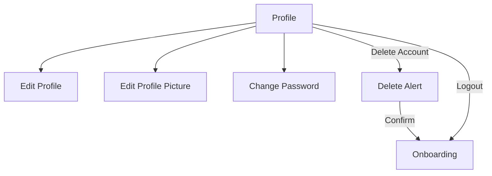

# Profile Module

> User settings, profile editing, and account management.

## Dependencies

| Package | Purpose |
|---------|---------|
| SignQuestUI | Shared components |
| SignQuestInterfaces | Coordinator protocols |
| SignQuestModels | `SQUser` |
| SignQuestCore | `UserManager`, `CloudinaryService` |
| FirebaseAuth | Password update |
| FirebaseFirestore | Profile data |

---

## Directory Structure

```
Sources/Profile/
├── Service/
│   ├── Coordinator/              # Navigation
│   └── Network/                  # Firestore updates
└── UI/
    ├── View/
    │   ├── Alert/                # Delete account confirmation
    │   ├── Change Password/      # Password update form
    │   ├── Coordinator/          # CoordinatorView wrapper
    │   ├── Edit Profile/         # Name/email editing
    │   ├── Edit Profile Picture/ # Image upload
    │   └── Profile/              # Main profile view
    └── ViewModel/
        ├── Change Password/
        ├── Edit Profile/
        ├── Edit Profile Picture/
        └── Profile/
```

---

## Navigation Flow



### Screen Types

```swift
public enum SQProfileScreenType {
    case profile
    case editProfile
    case editPassword
    case editProfilePicture
}
```

---

## Profile Overview Stats

The profile displays 4 statistics:

| Type | Icon | Description |
|------|------|-------------|
| `totalScore` | star | User's total XP |
| `signLearned` | hand.raised | Signs learned (levels × 5) |
| `dayStreak` | flame | Consecutive days |
| `levelCompleted` | medal | Completed levels |

```swift
struct SQProfileOverview {
    let type: SQProfileOverviewType
    var value: String
}
```

---

## Key Files

| File | Purpose |
|------|---------|
| [SQProfileViewModel.swift](file://Sources/Profile/UI/ViewModel/Profile/SQProfileViewModel.swift) | User data subscription, stats |
| [SQEditProfilePictureViewModel.swift](file://Sources/Profile/UI/ViewModel/Edit%20Profile%20Picture/SQEditProfilePictureViewModel.swift) | Cloudinary image upload |
| [SQChangePasswordViewModel.swift](file://Sources/Profile/UI/ViewModel/Change%20Password/SQChangePasswordViewModel.swift) | Firebase password update |
| [SQProfileNetworkService.swift](file://Sources/Profile/Service/Network/SQProfileNetworkService.swift) | Firestore profile updates |

---

## User Data Subscription

ViewModel subscribes to `UserManager` changes:

```swift
Publishers.CombineLatest(userManager.$authUser, userManager.$firestoreUser)
    .receive(on: DispatchQueue.main)
    .sink { [weak self] authUser, firestoreUser in
        // Update UI with user data
    }
    .store(in: &cancellables)
```

---

## Profile Picture Upload

Uses Cloudinary via `SignQuestCore`:

1. User selects image from camera/gallery
2. Image uploaded to Cloudinary
3. URL saved to Firestore `users/{uid}.image`
4. `UserManager` listener updates UI

---

## Common Tasks

### Adding a New Profile Setting

1. Add view in `UI/View/`
2. Add ViewModel in `UI/ViewModel/`
3. Add case to `SQProfileScreenType`
4. Add navigation in `SQProfileCoordinator.build()`

### Modifying Profile Stats

Edit `SQProfileOverviewType` enum and `setupOverviewItems(for:)` in ViewModel.

---

## Known Issues

- Day streak is hardcoded to "5" (not calculated)
- Delete account flow incomplete
- Tests are empty stubs
